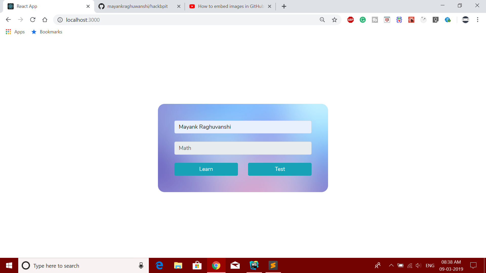
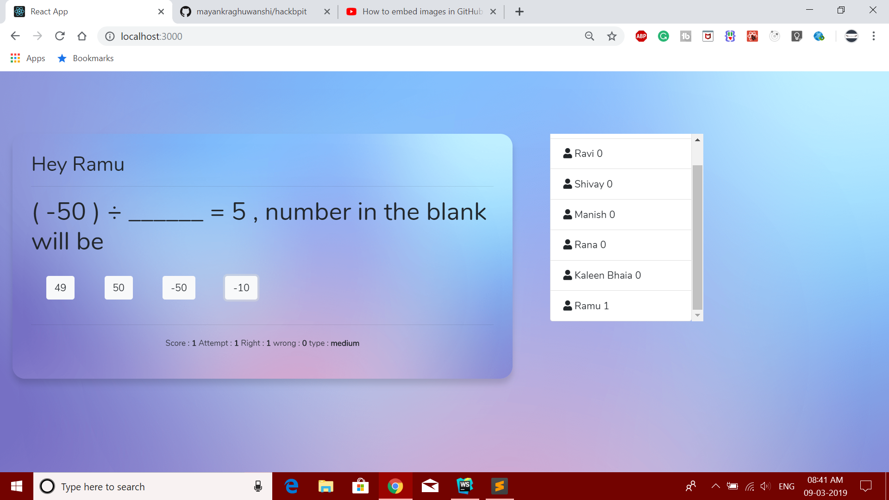
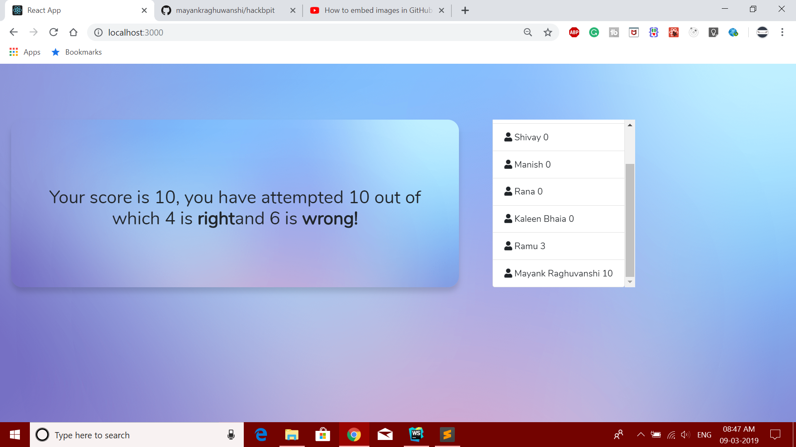

# HACKBPIT
## Adaptive Learning
# Landing Page

The landing page is having two input field, One is Name and the other is subject which is currently prefiled as Math.
it also consist two buttons one to open the learning mode and other is for test.

# Learning Mode

learning mode will contain some videos which user have to watch compleatly, after which some questions will be asked.
the questions will be based on the concept based on the video which played earlier.
according to the time and accuracy the questions will be changed and score will be updated accordingly.

# Learning Test

# Learn Result

# Test Mode

# Test Mode Result

